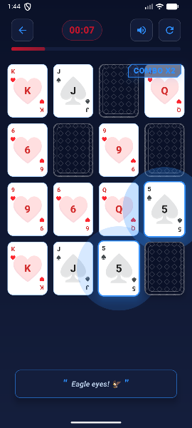
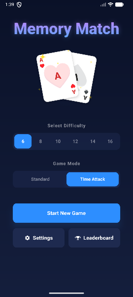
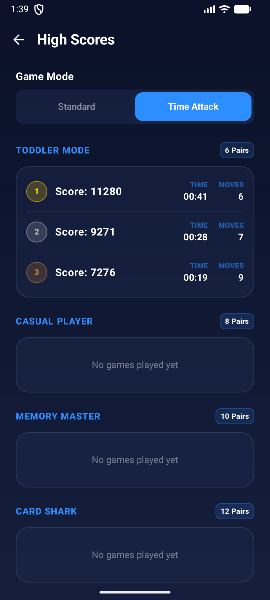
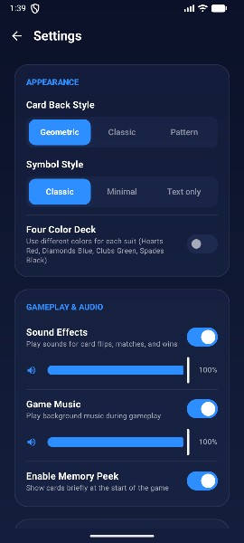
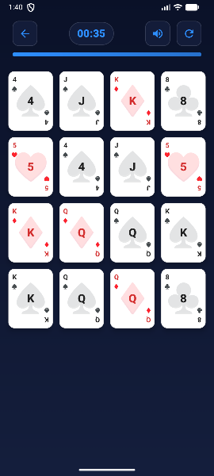
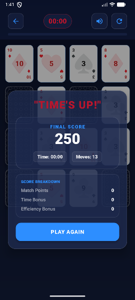
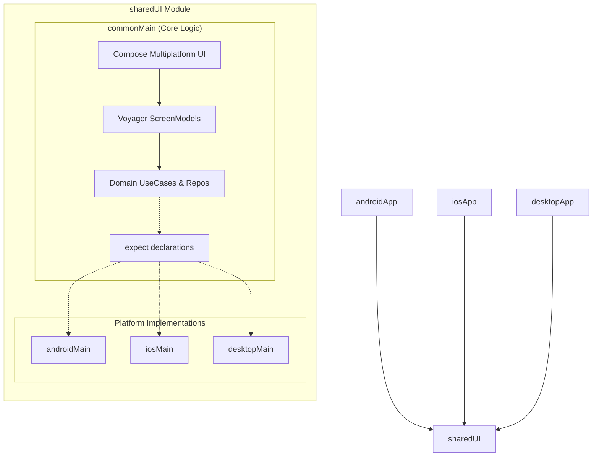

# Memory-Match

**A high-performance, cross-platform memory game built with Kotlin Multiplatform, showcasing modern 2026 development standards.**

<p align="center">
  
</p>

## 🚀 Platform Matrix

| Platform | Status | Support |
| :--- | :--- | :--- |
| **Android** | Stable | Native via Jetpack Compose |
| **iOS** | Beta | Compose Multiplatform (UIKit Interop) |
| **Desktop (JVM)** | Stable | Compose for Desktop |

---

## 📸 Screenshots

<p align="center">
  
  
  
</p>
<p align="center">
  
  
  
</p>

---

## 🏗 Project Structure

The project utilizes a modular strategy within the `sharedUI` module to maximize code sharing while allowing for platform-specific optimizations.

```text
.
├── androidApp/          # Android-specific entry point & Manifest
├── iosApp/              # iOS-specific Xcode project & Swift UI wrapper
├── desktopApp/          # Desktop-specific JVM launcher
├── sharedUI/            # Main KMP module containing logic and UI
│   ├── commonMain/      # 95%+ of code: Compose UI, ScreenModels, Domain logic
│   ├── androidMain/     # Android-specific implementations (e.g., Haptics, Audio)
│   ├── iosMain/         # iOS-specific implementations (e.g., AVFoundation)
│   └── desktopMain/     # Desktop-specific implementations (e.g., JVM File IO)
└── gradle/              # Version Catalog (libs.versions.toml)
```

### Architecture Overview

Built on **Clean Architecture** and **MVI-lite** principles. The following diagram shows how `commonMain` orchestrates logic through platform-specific `actual` implementations.



---

## 🛠 Tech Stack Detail

The project leverages a modern stack defined centrally in `gradle/libs.versions.toml` for consistent dependency management.

- **Language:** Kotlin 2.3.0 (K2 Mode, Context Parameters)
- **UI:** Compose Multiplatform 1.10.0 (Adaptive Layouts)
- **DI:** [Metro 0.9.4](https://github.com/ZacSweers/metro) (Compile-time safe, no KSP/Kapt)
- **Navigation:** Voyager 1.1.0-beta03 (Type-safe screens & ScreenModels)
- **Persistence:** Room (KMP) 2.8.4 (with Bundled SQLite)
- **Networking:** Ktor 3.3.3 (CIO Engine, Content Negotiation)
- **Concurrency:** Kotlin Coroutines 1.10.2 & Flow
- **Image Loading:** Coil3 3.3.0
- **Testing:** Turbine 1.2.1 (Flow testing) & Mokkery 3.1.1 (Mocking)

---

## ⚙️ Setup & Installation

### IDE Requirements
- **Android Studio Ladybug** (2024.2.1) or **IntelliJ IDEA 2024.3+**.
- **Kotlin Multiplatform** plugin installed and updated.
- **Compose Multiplatform IDE Support** plugin (recommended).

### Platform Specifics
- **iOS:** Xcode 15.0+ is required for building the `iosApp`.
- **Desktop:** JDK 17 or higher (Azul Zulu recommended).

### Environment Validation
Before starting development, run the diagnostic task to ensure all platforms are ready:
```bash
./gradlew check
```

---

## 🏃 How to Run

### Android
```bash
./gradlew :androidApp:installDebug
```

### iOS
1. Open `iosApp/iosApp.xcworkspace` in Xcode.
2. Select your target (Simulator or Device).
3. Click **Run** (Cmd + R).
*Alternatively, use **Fleet** for a unified KMP experience.*

### Desktop
```bash
./gradlew :desktopApp:run
```

---

## 🤝 Contribution Guidelines

We follow strict Clean Architecture and Kotlin 2.x idioms.
1. **Consistency:** Review `AGENTS.md` before making architectural changes.
2. **UI:** Keep 100% of UI in `sharedUI/commonMain` unless platform-specific interop is required.
3. **State Management:** Use Unidirectional Data Flow (UDF) via Voyager's `ScreenModel`.
4. **Commits:** Use [Conventional Commits](https://www.conventionalcommits.org/).

---
*Maintained by the Memory-Match Engineering Team.*
